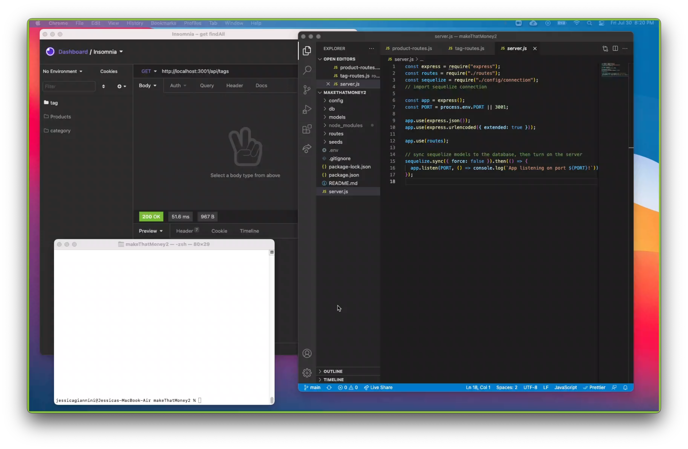

# makeThatMoney2

## Description

This application is a fast and easy way to update a database for an online store.

## Table of Contents

- [Description](#description)
- [Installation](#installation-instructions)
- [Usage](#usage)
- [License](#license)
- [Contributions](#contributions-guidelines)
- [Tests](#test-instructions)
- [Questions](#questions)

  ## Installation Instructions

  1.Clone the repository

  git clone

  2.Install all the dependencies which includes (dotenv, express, mysql2, sequelize )

  npm i

  3.Create a .env file and fill in your own password

  DB_NAME=ecommerce_db
  DB_USER=root
  DB_PW= <---Your Password

  4.Create the database - login in to mysql in terminal under the db directory.

  SOURCE schema.sql

  5.Seed the sample data

  npm run seed

  6.Run the server

  npm run start

## Author

<h3>
Jessica Giannini
</h3>

- Portfolio Site (https://github.com/JessGiannini/New-Web-Developer-Portfolio)
- Github(https://github.com/jessgiannini)
- LinkedIn (https://www.linkedin.com/in/jessica-aletta-giannini-155b1310/)

  ## Contributions Guidelines

  none

  ## Test Instructions

  npm run test

  ## Questions

  If you have any questions: jessgiannini@gmail.com

  [My GitHub](https://github.com/jessgiannini)

  ## Sample Image

  

  ## Video Link

  [Link](https://drive.google.com/file/d/1cdKpvE9xRYLRNnI93ex3oWuZ4ndElenY/view)
